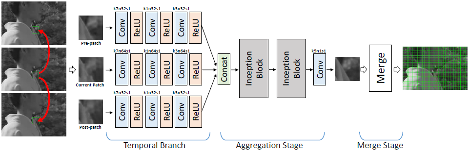
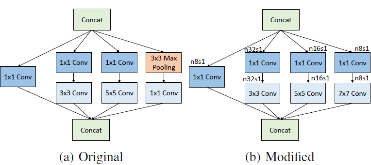
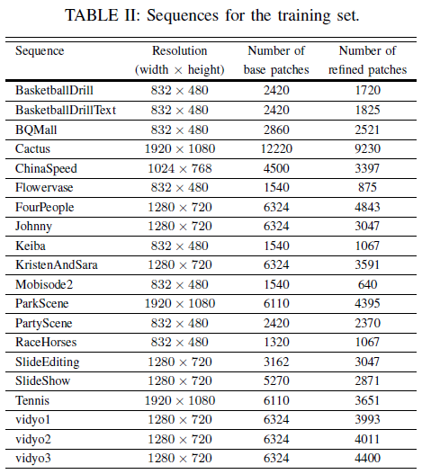
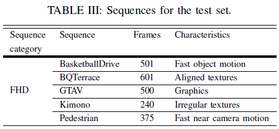
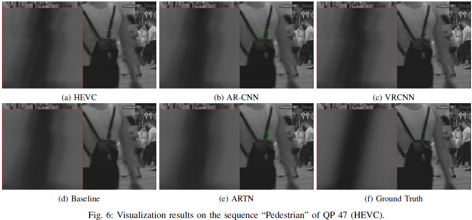
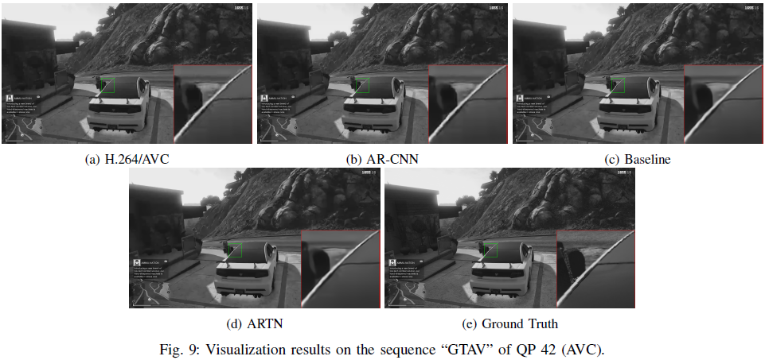
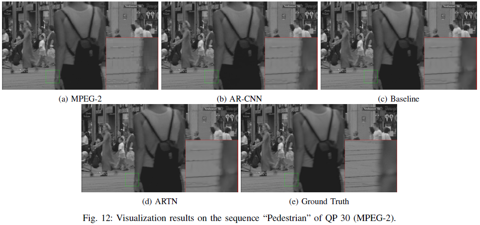
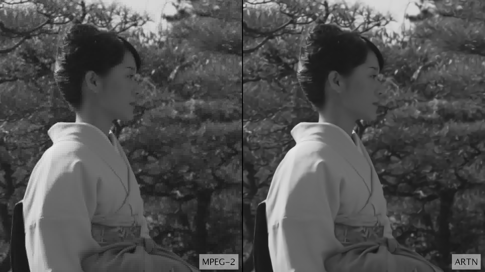

# ARTN

# [Reduction of Video Compression Artifacts Based on Deep Temporal Networks](https://ieeexplore.ieee.org/abstract/document/8502045)
<br><br>

## Requisites
- [Caffe](http://caffe.berkeleyvision.org/)
- Cuda & cuDNN
- Matlab

## Abstract

It has been shown that deep convolutional neural networks (CNN) reduce JPEG compression artifacts better than previous approaches. However, the latest video compression standards have more complex artifacts including flickering which are not well reduced by CNN-based methods developed for still images. Also, recent video compression algorithms include in-loop filters which reduce blocking artifacts, and thus post-processing barely improves the performance. In this paper, we propose a temporal-CNN architecture to reduce artifacts in video compression standards as well as in JPEG. Specifically, we exploit a simple CNN structure and introduce a new training strategy that captures the temporal correlation of consecutive frames in videos. Similar patches are aggregated from neighboring frames by a simple motion search method, and they are fed to the CNN, which further reduces the artifacts within a frame and suppresses flickering artifacts. Experiments show that our approach shows improvements over the conventional CNN-based methods with similar complexities, for image and video compression standards such as JPEG, MPEG-2, H.264/AVC, and HEVC.
<br><br>

## Related Work

### JPEG Artifact Reduction

#### [AR-CNN] Deep Convolution Networks for Compression Artifacts Reduction <a href="http://mmlab.ie.cuhk.edu.hk/projects/ARCNN.html">Link</a> 

### HEVC Intra

#### [VRCNN] A Convolutional Neural Network Approach for Post-Processing in HEVC Intra Coding <a href="https://arxiv.org/abs/1608.06690">Link</a> 

### CNN-based HEVC In-loop filter

#### [IFCNN] CNN-based in-loop filtering for coding efficiency improvement <a href="https://ieeexplore.ieee.org/document/7528223/">Link</a>
<br><br>

## Deep Temporal Network

<p align="center"></p>

The overall framework of the proposed network, where k, n, s above the convolution layers denote the kernel size, the number of output feature maps, and the convolution strides, respectively. 

<p align="center"></p>

Comparison of network-in-network structure from the (a) original Inception and (b) the modification for artifacts removal. 

## Training & Test Datasets

<p align="center">&nbsp;&nbsp;</p> 

The left table is the details of training datasets and the right table is the details of test datasets.

## Experimental Results

**Results of the average PSNR (dB) and SSIM for the testset**

Baseline model: the branches that receive the pre- and post-patches are removed.

### HEVC

|           | **QP 34** | **QP 37** | **QP 42** | **QP 47** |
|:---------:|:---------:|:---------:|:---------:|:---------:|
|   HEVC    | 34.7265 / 0.8821 | 33.4298 / 0.8608 | 31.1635 / 0.8202 | 28.8384 / 0.7739 |
|  AR-CNN   | 34.7929 / 0.8828 | 33.5159 / 0.8624 | 31.2827 / 0.8242 | 28.9797 / 0.7792 |
| Baseline  | 34.8638 / 0.8846 | 33.5927 / 0.8636 | 31.3770 / 0.8254 | 29.0260 / 0.7803 |
|   ARTN    | **34.9442 / 0.8851**| **33.6639 / 0.8650**| **31.4133 / 0.8261** | **29.0622 / 0.7805** |

### AVC

|           | **QP 34** | **QP 37** | **QP 42** | **QP 47** |
|:---------:|:---------:|:---------:|:---------:|:---------:|
|   AVC     | 35.3253 / 0.8913 | 33.9823 / 0.8695 | 31.6603 / 0.8271 | 29.2120 / 0.7777 |
|  AR-CNN   | 35.3514 / 0.8916 | 34.0071 / 0.8699 | 31.7993 / 0.8305 | 29.4555 / 0.7861 |
| Baseline  | 35.6707 / 0.8962 | 34.2924 / 0.8751 | 32.0342 / 0.8365 | 29.6045 / 0.7903 |
|   ARTN    | **35.7868 / 0.8981** | **34.4611 / 0.8776** | **32.1313 / 0.8377** | **29.6632 / 0.7922** |

### MPEG-2


|           | **QP 20** | **QP 30** |
|:---------:|:---------:|:---------:|
|  MPEG-2   | 32.9493 / 0.8435 | 31.3361 / 0.8086 |
|  AR-CNN   | 33.8265 / 0.8658 | 32.2970 / 0.8375 |
| Baseline  | 34.0655 / 0.8705 | 32.4580 / 0.8409 |
|   ARTN    | **34.2318 / 0.8719** | **32.5964 / 0.8434** |

### Visualized Results

<p align="center"></p>
Results for HEVC. 
<br><br>
<p align="center"></p>
Results for AVC. 
<br><br>
<p align="center"></p>
Results for MPEG-2. 
<br><br>

- Video results for MPEG-2 QP 30 <a href="https://drive.google.com/open?id=1FzcQzhtDp8vkyihoK9f_ZyClNJeuhEiC"> Kimono_Comparison.yuv </a>


* Video Snapshot

### Test dataset
- 5 Sequences: BasketballDrive, BQTerrace, GTAV, Kimono, Pedestrian
- Y-channel PNG files are available. [Download](https://drive.google.com/open?id=1hEbrkZ9JtXI-kFFDoWClFkrzjkPg9GIU)

## Citation
```
@article{soh2018reduction,
  title={Reduction of Video Compression Artifacts Based on Deep Temporal Networks},
  author={Soh, Jae Woong and Park, Jaewoo and Kim, Yoonsik and Ahn, Byeongyong and Lee, Hyun-Seung and Moon, Young-Su and Cho, Nam Ik},
  journal={IEEE Access},
  volume={6},
  pages={63094--63106},
  year={2018},
  publisher={IEEE}
}
```
